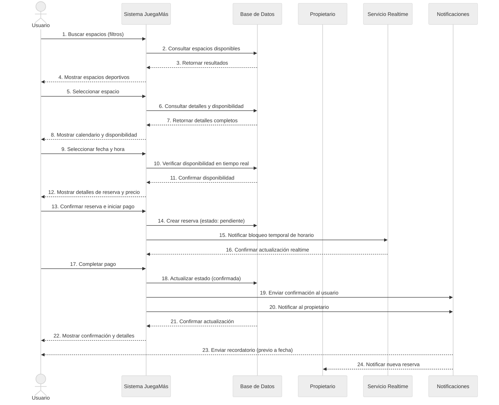
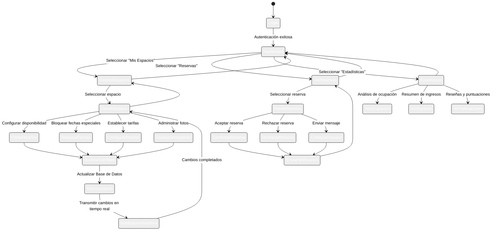
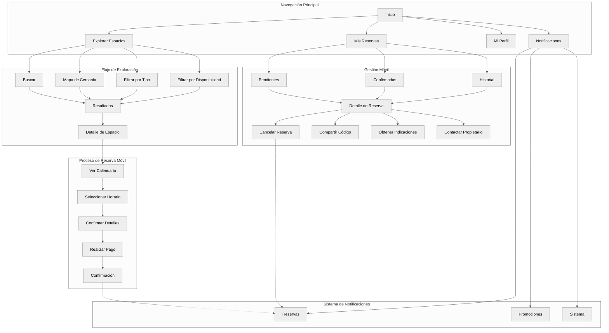

# 👥 Diagramas de Casos de Uso - JuegaMás

## 📋 Actores del Sistema

- **Usuario No Registrado**: Visitante que navega la plataforma sin autenticación
- **Usuario**: Persona que busca y reserva espacios deportivos
- **Propietario**: Administrador de espacios deportivos 
- **Administrador**: Personal de JuegaMás con acceso total al sistema

## 🔍 Diagrama General de Casos de Uso

```mermaid
%%{init: {'theme': 'neutral', 'themeVariables': { 'primaryColor': '#5d87ff', 'primaryTextColor': '#fff', 'primaryBorderColor': '#5d87ff', 'lineColor': '#555', 'secondaryColor': '#26c6da', 'tertiaryColor': '#fff'}}}%%
flowchart TD
    subgraph Sistema["Sistema JuegaMás"]
        subgraph GestionUsuarios["Gestión de Usuarios"]
            CU1("Registrar cuenta")
            CU2("Iniciar sesión")
            CU3("Gestionar perfil")
            CU4("Recuperar contraseña")
        end
        
        subgraph GestionEspacios["Gestión de Espacios Deportivos"]
            CU5("Buscar espacios")
            CU6("Ver detalles de espacio")
            CU7("Crear espacio deportivo")
            CU8("Gestionar espacio")
            CU9("Configurar disponibilidad")
            CU10("Administrar imágenes")
        end
        
        subgraph GestionReservas["Gestión de Reservas"]
            CU11("Reservar espacio")
            CU12("Ver disponibilidad")
            CU13("Gestionar reservas")
            CU14("Pagar reserva")
            CU15("Cancelar reserva")
            CU16("Confirmar reserva")
        end
        
        subgraph GestionActividad["Gestión de Actividad"]
            CU17("Dejar reseña")
            CU18("Ver historial")
            CU19("Recibir notificaciones")
            CU20("Ver estadísticas")
        end
        
        subgraph GestionAdmin["Administración"]
            CU21("Verificar espacios")
            CU22("Gestionar usuarios")
            CU23("Ver reportes")
            CU24("Configurar sistema")
        end
    end
    
    Usuario_No_Registrado["Usuario No Registrado"] --> CU1
    Usuario_No_Registrado --> CU2
    Usuario_No_Registrado --> CU5
    Usuario_No_Registrado --> CU6
    
    Usuario["Usuario"] --> CU3
    Usuario --> CU4
    Usuario --> CU5
    Usuario --> CU6
    Usuario --> CU11
    Usuario --> CU12
    Usuario --> CU13
    Usuario --> CU14
    Usuario --> CU15
    Usuario --> CU17
    Usuario --> CU18
    Usuario --> CU19
    
    Propietario["Propietario"] --> CU3
    Propietario --> CU4
    Propietario --> CU7
    Propietario --> CU8
    Propietario --> CU9
    Propietario --> CU10
    Propietario --> CU13
    Propietario --> CU16
    Propietario --> CU18
    Propietario --> CU19
    Propietario --> CU20
    
    Administrador["Administrador"] --> CU21
    Administrador --> CU22
    Administrador --> CU23
    Administrador --> CU24
```

## 🎯 Caso de Uso Principal: Reserva de Espacio Deportivo

### Diagrama de Flujo Detallado

### Descripción Textual

**Caso de Uso:** Reserva de Espacio Deportivo  
**Actor Principal:** Usuario  
**Actores Secundarios:** Propietario, Sistema de Notificaciones  
**Precondiciones:** Usuario autenticado en el sistema  

#### Flujo Básico

1. **Búsqueda de Espacios**
   - El Usuario ingresa criterios de búsqueda (ubicación, tipo de cancha, fecha, hora)
   - El Sistema muestra resultados que cumplen los criterios

2. **Exploración y Selección**
   - El Usuario selecciona un espacio deportivo
   - El Sistema muestra detalles (fotos, características, precio, reseñas)
   - El Sistema muestra calendario con disponibilidad en tiempo real

3. **Selección de Horario**
   - El Usuario selecciona fecha y hora para la reserva
   - El Sistema verifica disponibilidad en tiempo real
   - El Sistema muestra resumen (horario, duración, precio)

4. **Confirmación y Pago**
   - El Usuario confirma detalles y procede al pago
   - El Sistema bloquea temporalmente el horario
   - El Usuario completa el pago
   - El Sistema confirma la reserva y actualiza disponibilidad

5. **Notificación**
   - El Sistema envía confirmación al Usuario (email/push)
   - El Sistema notifica al Propietario sobre la nueva reserva
   - El Sistema programa recordatorios para ambas partes

#### Flujos Alternativos

1. **Disponibilidad Cambia Durante Proceso**
   - Si otro usuario reserva el mismo horario antes de completar el pago
   - El Sistema notifica en tiempo real la indisponibilidad
   - Se ofrece horarios alternativos cercanos

2. **Fallo en el Pago**
   - Si el pago no se completa correctamente
   - El Sistema libera el horario bloqueado temporalmente
   - Se permite al usuario reintentar o seleccionar otro método

3. **Cancelación**
   - El Usuario puede cancelar según política (tiempo previo)
   - El Sistema actualiza disponibilidad
   - Se procesa reembolso según política

## 🔄 Diagrama de Caso de Uso: Gestión de Disponibilidad (Propietario)

### Descripción Textual

**Caso de Uso:** Gestión de Disponibilidad  
**Actor Principal:** Propietario  
**Precondiciones:** Propietario autenticado con al menos un espacio deportivo registrado  

#### Flujo Básico

1. **Acceso a Gestión**
   - El Propietario accede a la sección "Mis Espacios"
   - El Sistema muestra listado de espacios deportivos
   - El Propietario selecciona un espacio específico

2. **Configuración de Horarios**
   - El Sistema muestra vista de calendario semanal
   - El Propietario configura horarios disponibles por día de semana
   - El Propietario establece precios regulares y especiales por horario

3. **Gestión de Excepciones**
   - El Propietario puede bloquear fechas específicas (mantenimiento, eventos privados)
   - El Sistema permite bloqueos de día completo o franjas horarias

4. **Sincronización y Publicación**
   - El Propietario guarda los cambios
   - El Sistema actualiza la base de datos
   - El Sistema propaga cambios en tiempo real a usuarios navegando la disponibilidad

## 📱 Diagrama de Caso de Uso: Experiencia del Usuario Móvil

### Especificación de Escenarios Principales

#### Escenario 1: Reserva Exitosa

**Título:** Reserva Exitosa de Cancha de Fútbol  
**Actor Principal:** María (Usuario)  
**Objetivo:** Reservar una cancha de fútbol para el sábado por la tarde  

**Escenario:**
1. María abre la aplicación JuegaMás y busca "canchas de fútbol"
2. Filtra por ubicación cercana y disponibilidad para sábado
3. Encuentra "Estadio Rápido" con horario disponible de 16:00-17:00
4. Revisa fotos, características y reseñas de la cancha
5. Selecciona el horario de 16:00-17:00 y confirma la reserva
6. Completa el pago con tarjeta de crédito guardada
7. Recibe confirmación inmediata y notificación por email
8. La reserva aparece en su sección "Mis Reservas"
9. Recibe recordatorio 2 horas antes de la reserva

**Resultado:** María tiene una reserva confirmada para el sábado.

#### Escenario 2: Gestión de Disponibilidad

**Título:** Configuración de Horarios Especiales por Temporada  
**Actor Principal:** Carlos (Propietario)  
**Objetivo:** Actualizar disponibilidad y precios para temporada alta  

**Escenario:**
1. Carlos ingresa a su panel de propietario
2. Selecciona su espacio "Canchas Deportivas El Parque"
3. Accede a "Configurar disponibilidad"
4. Modifica horarios disponibles extendiendo hasta 23:00 en verano
5. Aumenta precios en 15% para horarios de fin de semana
6. Bloquea fechas de mantenimiento programado
7. Guarda cambios y publica actualizaciones
8. El sistema actualiza la disponibilidad en tiempo real
9. Usuarios navegando el espacio ven los nuevos horarios y precios

**Resultado:** Los cambios de disponibilidad se reflejan inmediatamente para todos los usuarios.

#### Escenario 3: Cancelación y Reembolso

**Título:** Cancelación de Reserva con Reembolso Parcial  
**Actor Principal:** Diego (Usuario)  
**Objetivo:** Cancelar una reserva realizada con anticipación  

**Escenario:**
1. Diego ingresa a la aplicación y va a "Mis Reservas"
2. Selecciona su reserva pendiente de cancha de tenis
3. Pulsa en "Cancelar Reserva" y confirma
4. El sistema verifica que la cancelación es con 48h de anticipación
5. Muestra información de política de reembolso (70% del valor)
6. Diego confirma la cancelación
7. El sistema procesa el reembolso parcial
8. La reserva cambia a estado "Cancelada" en su historial
9. El horario queda nuevamente disponible para otros usuarios
10. El propietario recibe notificación de la cancelación

**Resultado:** Diego obtiene reembolso parcial y el horario vuelve a estar disponible.

## 🔍 Métricas y Objetivos de Casos de Uso

| Caso de Uso | Métrica de Éxito | Objetivo |
|-------------|------------------|----------|
| Búsqueda de Espacios | Tiempo promedio hasta reserva | < 3 minutos |
| Reserva | Tasa de conversión (vistas → reservas) | > 15% |
| Reserva | Tasa de abandono en pago | < 25% |
| Notificaciones | Tasa de apertura | > 60% |
| Reseñas | Porcentaje de reservas con reseña | > 40% |
| Cancelaciones | Tasa de cancelaciones | < 15% |
| Disponibilidad | Tasa de ocupación espacios | > 65% | 