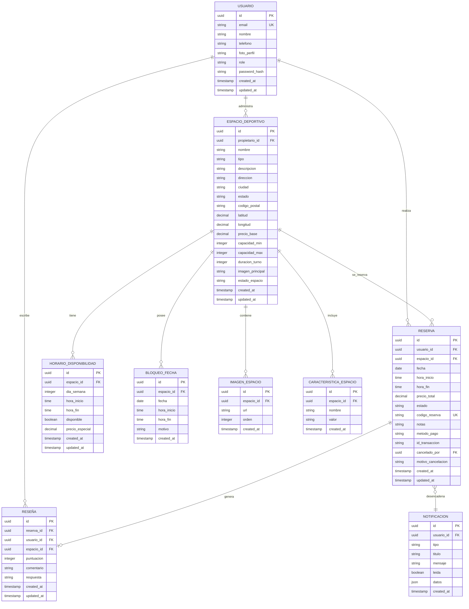

# 🔄 Diagrama Entidad-Relación - JuegaMás

## 📊 Modelo Conceptual

## 📈 Relaciones Principales

### 1️⃣ Usuario - Espacio Deportivo
- Un **Usuario** con rol "propietario" puede administrar **múltiples Espacios Deportivos**
- Un **Espacio Deportivo** pertenece a un **único Usuario propietario**

### 2️⃣ Espacio Deportivo - Horarios 
- Un **Espacio Deportivo** tiene **múltiples Horarios de Disponibilidad** (por día de semana)
- Un **Espacio Deportivo** puede tener **múltiples Bloqueos de Fecha** (excepciones)

### 3️⃣ Usuario - Reserva
- Un **Usuario** puede realizar **múltiples Reservas**
- Una **Reserva** pertenece a un **único Usuario**

### 4️⃣ Espacio Deportivo - Reserva
- Un **Espacio Deportivo** puede tener **múltiples Reservas**
- Una **Reserva** corresponde a un **único Espacio Deportivo**

### 5️⃣ Reserva - Reseña
- Una **Reserva** puede generar como máximo **una Reseña**
- Una **Reseña** pertenece a **una única Reserva**

### 6️⃣ Espacio Deportivo - Características/Imágenes
- Un **Espacio Deportivo** tiene **múltiples Características** (vestuarios, iluminación, etc.)
- Un **Espacio Deportivo** contiene **múltiples Imágenes**

## 🛡️ Restricciones de Integridad

### Claves Primarias
Todas las entidades utilizan identificadores UUID como clave primaria

### Claves Foráneas
- `ESPACIO_DEPORTIVO.propietario_id` → `USUARIO.id`
- `HORARIO_DISPONIBILIDAD.espacio_id` → `ESPACIO_DEPORTIVO.id`
- `BLOQUEO_FECHA.espacio_id` → `ESPACIO_DEPORTIVO.id`
- `RESERVA.usuario_id` → `USUARIO.id`
- `RESERVA.espacio_id` → `ESPACIO_DEPORTIVO.id`
- `RESERVA.cancelado_por` → `USUARIO.id`
- `RESEÑA.reserva_id` → `RESERVA.id`
- `RESEÑA.usuario_id` → `USUARIO.id`
- `RESEÑA.espacio_id` → `ESPACIO_DEPORTIVO.id`
- `IMAGEN_ESPACIO.espacio_id` → `ESPACIO_DEPORTIVO.id`
- `CARACTERISTICA_ESPACIO.espacio_id` → `ESPACIO_DEPORTIVO.id`
- `NOTIFICACION.usuario_id` → `USUARIO.id`

### Restricciones Adicionales
1. Horarios válidos: `hora_fin > hora_inicio` en `HORARIO_DISPONIBILIDAD` y `BLOQUEO_FECHA`
2. Puntuación en rango: `puntuacion BETWEEN 1 AND 5` en `RESEÑA`
3. Código único: `codigo_reserva` es único en `RESERVA`
4. Email único: `email` es único en `USUARIO`
5. Valores de estado: `estado` en `RESERVA` debe ser uno de ['pendiente', 'confirmada', 'cancelada', 'completada']
6. Bloqueo de fechas: Un bloqueo puede ser de día completo (`hora_inicio` y `hora_fin` ambos NULL) o de un rango específico

## 🧠 Lógica de Negocio Clave

### Verificación de Disponibilidad
Para crear una reserva válida se verifica:
1. Que no exista otra reserva en ese horario para el mismo espacio
2. Que no exista un bloqueo en esa fecha/horario
3. Que exista un horario disponible configurado para ese día y hora

### Actualización de Estado de Reserva
Cuando una reserva cambia de estado:
1. Se registra quién realiza la cancelación (si aplica)
2. Se genera una notificación para el usuario
3. Se actualiza la disponibilidad en tiempo real

### Cálculo de Precios
El precio de una reserva considera:
1. El precio base del espacio deportivo
2. Precios especiales configurados para días/horarios específicos
3. Duración de la reserva

## 🔍 Índices Principales

### Índices para Búsqueda
- `idx_espacios_deportivos_ciudad`: Para búsqueda por ubicación
- `idx_espacios_deportivos_tipo`: Para filtrado por tipo de espacio
- `idx_espacios_coords`: Para búsquedas geoespaciales
- `idx_horarios_dia`: Para búsqueda rápida de disponibilidad por día

### Índices para Relaciones
- `idx_reservas_usuario`: Para historial de reservas de usuario
- `idx_reservas_espacio`: Para reservas de un espacio específico
- `idx_reservas_fecha`: Para reservas en una fecha dada
- `idx_reseñas_espacio`: Para mostrar reseñas de un espacio

## 📱 Consideraciones UX/Rendimiento

1. Las vistas materializadas (`vista_disponibilidad`, `vista_reservas_completa`) optimizan consultas frecuentes
2. El sistema de notificaciones permite alertas en tiempo real cuando cambia el estado de reservas
3. Los bloqueos de fechas permiten gestionar excepciones (mantenimiento, días festivos)
4. Las características permiten filtros avanzados para usuarios
5. La estructura normalizada mantiene la integridad de datos mientras facilita consultas eficientes 